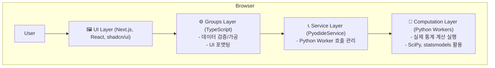

# 시스템 개요 (System Overview)

**버전**: 1.0.0
**최종 수정일**: 2025-10-14

이 문서는 **전문가급 통계 분석 플랫폼**의 전체 아키텍처, 핵심 워크플로우, 주요 문서 구조를 설명하는 최상위 가이드입니다.

---

## 🎯 프로젝트 목표

- **비전**: SPSS, R Studio 수준의 고급 통계 분석을 웹 브라우저에서 누구나 쉽게 사용하도록 제공
- **대상**: 수산과학 연구자, 통계 전문가, 데이터 분석가, 학생
- **핵심 기술**: Next.js, TypeScript, Pyodide (WebAssembly 기반 Python), SciPy, statsmodels

---

## 🏗️ 아키텍처

본 플랫폼은 사용자 인터페이스(TypeScript)와 실제 통계 계산(Python)을 명확히 분리한 계층적 아키텍처를 따릅니다.

**핵심 원칙**: 모든 통계 계산은 검증된 Python 라이브러리를 통해 Python Worker에서만 수행됩니다. TypeScript(JavaScript)는 데이터 준비와 결과 표시에만 집중합니다.

---

## 🗺️ 문서 구조 가이드

프로젝트의 모든 문서는 `statistical-platform/docs/` 디렉토리 아래에 체계적으로 관리됩니다.

| 폴더 | 설명 | 주요 문서 |
| :--- | :--- | :--- |
| `0_overview/` | **프로젝트 전체 개요**: 로드맵, 저작권 등 | `ROADMAP.md`, `COPYRIGHT.md` |
| `1_guides/` | **개발자/사용자 가이드**: 코딩 규칙, 개발 환경 | `DEVELOPER_GUIDE.md`, `AI_CODING_RULES.md` |
| `2_architecture/` | **아키텍처 설계**: 시스템 구조, 기술 결정 | `phase5-architecture.md`, `worker-service-architecture.md` |
| `3_specifications/` | **기능/API 명세**: 통계 메서드, API 레퍼런스 | `STATISTICAL_METHODS_COMPLETE_GUIDE.md` |
| `9_archive/` | **과거 기록 보관**: 일일 로그, 코드 리뷰 등 | `logs/`, `reviews/` |

---

## ⚖️ 저작권 및 라이선스 (요약)

본 프로젝트에서 사용하는 모든 핵심 라이브러리는 **상업적 사용이 가능합니다.**

- **허용적 라이선스**: `Next.js`(MIT), `SciPy`(BSD), `statsmodels`(BSD) 등 대부분의 라이브러리는 소스코드 공개 의무 없이 상업적 이용이 자유롭습니다.
- **조건부 허용 라이선스**: `Pyodide`(MPL-2.0)는 라이브러리 자체를 수정하는 경우에만 수정된 파일의 소스코드를 공개할 의무가 있으며, 앱 전체 코드에는 영향을 주지 않습니다.
- **사용 금지 라이선스**: 상업적 이용에 제약이 있는 `GPL`, `AGPL`, `CC-NC` 등의 라이선스를 가진 라이브러리는 사용이 금지됩니다.

> **상세 정보**: **COPYRIGHT.md** 파일을 반드시 참조하십시오.

---

## 🚀 시작하기

1.  **프로젝트 이해**: `README.md`와 현재 문서를 읽어 전체 구조를 파악합니다.
2.  **개발 환경 설정**: `statistical-platform/README.md`의 지침에 따라 환경을 설정합니다.
3.  **코딩 규칙 숙지**: `CLAUDE.md`와 `docs/AI-CODING-RULES.md`를 통해 코딩 표준을 확인합니다.
4.  **작업 시작**: `dailywork.md`를 참고하여 현재 진행 중인 작업을 이어갑니다.

---

## 🔗 핵심 문서 링크

- **프로젝트 README**: 프로젝트의 첫 관문
- **플랫폼 README**: 개발자를 위한 상세 가이드
- **CLAUDE.md**: AI 어시스턴트 작업 가이드
- **워크플로우 명세**: 5단계 분석 흐름 상세 정의
- **저작권 및 라이선스**: 법적 준수 사항
- **Phase 5 아키텍처**: 현재 아키텍처 상세 설명