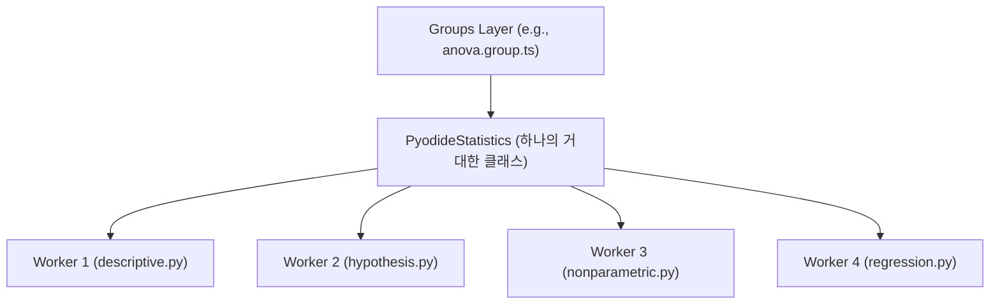
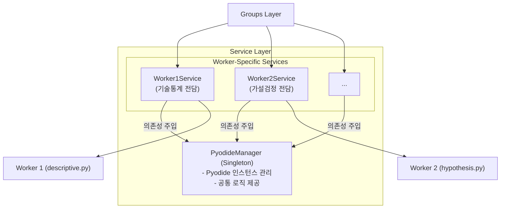

# 기술 아키텍처 제안: Worker별 서비스 분리

**문서 버전**: 1.0
**작성일**: 2025-10-14
**작성자**: Gemini Code Assist
**관련 문서**: [system_overview.md](../system_overview.md)

## 1. 개요

이 문서는 현재 단일 파일로 구성된 `pyodide-statistics.ts` 서비스 레이어를 각 Python Worker에 대응하는 여러 개의 독립적인 서비스 파일로 분리하는 리팩토링 아키텍처를 제안합니다.

이 문서는 해당 아키텍처의 기술적 배경, 장점, 그리고 구체적인 구현 방안을 설명하여, 개발팀 구성원 간의 명확한 기술적 이해와 소통을 돕는 것을 목표로 합니다.

---

## 2. 현재 아키텍처 (As-Is)

현재 서비스 레이어는 `PyodideStatistics`라는 단일 클래스가 모든 Python Worker(1-4)와의 통신을 전담하는 **퍼사드 패턴(Facade Pattern)** 구조입니다.

### 2.1. 구조도



### 2.2. 현 구조의 장단점

- **장점**:
  - **단순한 진입점**: 모든 통계 기능이 `PyodideStatistics`라는 하나의 클래스를 통해 제공되므로 사용하기 간편합니다.

- **단점**:
  - **낮은 응집도 (Low Cohesion)**: `pyodide-statistics.ts` 파일(약 2,500줄)이 기술통계, 가설검정, 회귀분석 등 서로 다른 여러 도메인의 책임을 모두 가지고 있습니다.
  - **강한 결합도 (High Coupling)**: Worker 1에 관련된 코드를 수정해도 전체 파일에 영향을 미쳐, 다른 Worker 기능에 예기치 않은 버그를 유발할 수 있습니다.
  - **유지보수의 어려움**: 파일이 너무 커서 특정 코드를 찾거나 수정하기 어렵고, 여러 개발자가 동시에 작업할 때 코드 충돌(Merge Conflict)이 발생할 확률이 높습니다.

---

## 3. 제안 아키텍처 (To-Be)

제안하는 구조는 **단일 책임 원칙(Single Responsibility Principle, SRP)**에 따라, 각 Worker별로 독립된 서비스 파일을 만들고, Pyodide 인스턴스 관리는 중앙 관리자(Manager)가 전담하는 방식입니다.

### 3.1. 구조도



### 3.2. 핵심 컴포넌트 역할

- **`PyodideManager` (중앙 관리자)**
  - **싱글톤(Singleton) 패턴**: 애플리케이션 전체에서 단 하나의 Pyodide 인스턴스만 생성하고 관리합니다.
  - **역할**: Pyodide 초기화, 패키지 로딩, Worker 파일 로딩 등 모든 서비스가 공유하는 공통 기능을 담당합니다.

- **`WorkerNService` (개별 서비스)**
  - **단일 책임**: 각 서비스는 오직 하나의 Python Worker(예: `worker1.py`)와 통신하는 책임만 가집니다.
  - **의존성 주입(Dependency Injection)**: 생성자(constructor)를 통해 `PyodideManager`의 인스턴스를 주입받아 Pyodide 기능을 사용합니다.

### 3.3. 코드 예시

#### `pyodide-manager.ts` (가칭)
```typescript
import { loadPyodide, PyodideInterface } from 'pyodide';

export class PyodideManager {
  private static instance: PyodideManager;
  public pyodide: PyodideInterface | null = null;

  private constructor() {}

  public static getInstance(): PyodideManager {
    if (!PyodideManager.instance) {
      PyodideManager.instance = new PyodideManager();
    }
    return PyodideManager.instance;
  }

  async initialize(): Promise<PyodideInterface> {
    if (this.pyodide) return this.pyodide;
    
    this.pyodide = await loadPyodide({
      indexURL: 'https://cdn.jsdelivr.net/pyodide/v0.28.3/full/',
    });
    // ... 공통 패키지 로딩 로직 ...
    return this.pyodide;
  }
  
  // ... 기타 공통 로직 (ensureWorkerLoaded 등) ...
}
```

#### `worker-1-service.ts` (가칭)
```typescript
import { PyodideManager } from './pyodide-manager';

export class Worker1Service {
  private manager: PyodideManager;

  constructor() {
    this.manager = PyodideManager.getInstance();
  }

  async descriptiveStats(data: number[]): Promise<DescriptiveStatsResult> {
    const pyodide = await this.manager.initialize();
    // await this.manager.ensureWorkerLoaded(1); // Worker 1 로딩 보장

    const resultStr = await pyodide.runPythonAsync(`
      # worker1_module의 함수만 호출
      from worker1_module import descriptive_stats
      result = descriptive_stats(${JSON.stringify(data)})
      # ...
    `);
    
    // ... 결과 파싱 로직 ...
    return parsedResult;
  }
}
```

---

## 4. 기대 효과 및 결론

이 아키텍처는 장기적인 관점에서 프로젝트의 품질을 크게 향상시킬 수 있습니다.

- **유지보수성 향상**: 특정 기능 수정 시 영향 범위가 해당 서비스 파일로 한정되어 버그 발생 가능성이 줄어듭니다.
- **가독성 및 탐색 용이성**: 2,500줄의 거대 파일 대신, 각 300~600줄 내외의 작은 파일들로 구성되어 코드를 이해하기 쉬워집니다.
- **확장성 증대**: 새로운 Worker(예: `worker5.py`)가 추가될 때, `Worker5Service.ts` 파일만 새로 만들면 되므로 기존 코드에 영향을 주지 않고 안전하게 확장할 수 있습니다.
- **팀 협업 효율 증대**: 여러 개발자가 서로 다른 서비스 파일을 동시에 작업할 수 있어 코드 충돌이 최소화됩니다.

### 최종 권장사항

`ROADMAP.md`에 명시된 대로, 이 리팩토링은 **Phase 9 (배포 전 리팩토링 및 최적화)** 단계에서 진행하는 것을 권장합니다. 현재 코드는 이미 높은 품질을 가지고 있으므로, 당장은 테스트 작성 및 신규 기능 구현에 집중하고, 장기적인 코드 품질 향상을 위해 이 아키텍처를 도입하는 것이 이상적입니다.