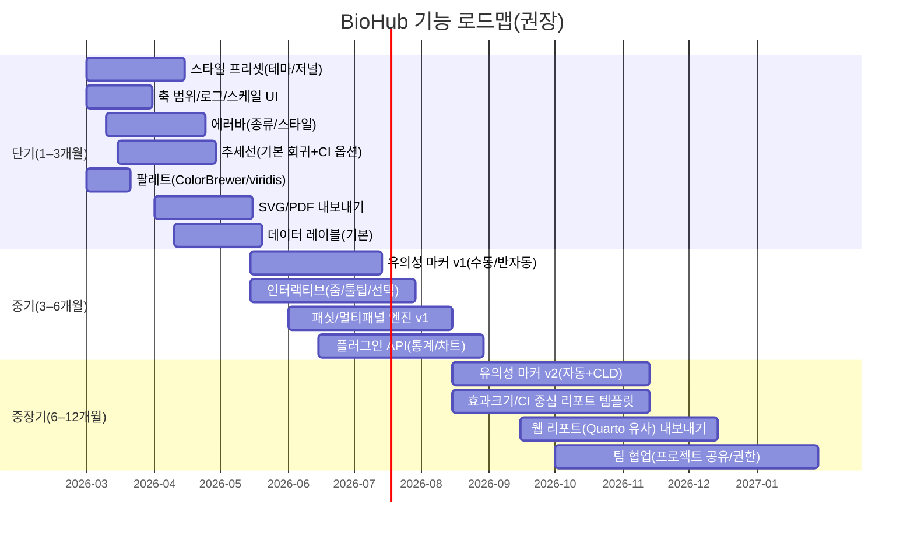

# Graph Studio 경쟁 분석 및 BioHub 전략

> **최종 업데이트**: 2026-03-01 (v2: 저널 팔레트 hex 값, Gap Analysis, Raincloud 트렌드, BioHub G2 완료 현황 추가)
> **출처**: 외부 AI 딥리서치 (공식 릴리스·가이드·포럼 기반, citeturn 인용 포함) + 내부 분석
> **목적**: Graph Studio를 논문용 그래프 도구로 발전시키기 위한 시장 분석 + 경쟁 전략 + 구현 우선순위

---

## Executive Summary

2024–2026 기간 동안 **GraphPad Prism**은 "생명과학 연구자에게 익숙한 GUI + 통계 자동화"라는 본질적 강점을 유지하면서, **Prism Cloud 기반 협업(브라우저 접근/공유)**과 **다변량(Multiple Variables) 워크플로우 강화(계산 변수·다요인 ANOVA·효과크기 보고)**로 제품 축을 넓혔다. citeturn2view0turn3view0turn6view2turn28search7turn28search11
**Origin(Origin/OriginPro)**는 Windows 중심의 "데이터 핸들링 + 공학/실험 데이터 시각화" 전통 위에, **다크 모드·축 범위의 직접 조작·그래프 기반 필터링(Slicer)** 같은 인터랙티브 탐색과, **Excel 유사 생산성(Flash Fill/Smart Formula, 수식 유지, 프로젝트 검색)**을 전면으로 내세워 사용 흐름을 단축하는 방향으로 진화했다. citeturn14view0turn14view1turn14view3turn28search1turn8view0
**ggplot2**는 2024–2026에 걸쳐 사용자가 체감하는 "예쁜 그래프" 자체보다, **가이드(축/범례) 시스템의 대대적 재구성**과 **S3→S7 전환** 등 내부 구조를 현대화해 **확장 패키지 생태계가 더 깊게 개입할 수 있는 기반**을 만든 것이 핵심이다. 다만 이 과정에서 **스타일·테마의 동작 변화/레거시 코드 깨짐**이 커뮤니티에서 반복적으로 관찰되었고, 재현 가능한 환경(버전 고정) 요구가 더 강해졌다. citeturn11view5turn12view0turn21search6turn21search10turn21search28

BioHub는 현재 외부에 공개된 사양/기능 문서가 없어 "현황 대비표"를 사실로 단정할 수는 없다. 따라서 본 보고서는 (a) Prism/Origin/ggplot2의 **공식 릴리스·가이드**와 (b) 포럼/이슈에서 드러나는 실제 사용자의 **마찰 지점**을 근거로, BioHub가 **단기(1–3개월)**에 "Prism/Origin 수준의 생산성 기능"을 빠르게 따라잡고, **중기(3–12개월)**에 "재현성·자동 보고·협업"으로 차별화하도록 로드맵을 제안한다. citeturn28search3turn34search0turn14view1

---

## 경쟁 제품의 최신 기능과 로드맵 신호

### 2024–2026 주요 릴리스 하이라이트 요약

| 제품 | 2024–2026 주요 버전·시점(공식) | 핵심 변화(요약) | 로드맵 신호 |
|---|---|---|---|
| Prism | Prism 10.2(2024-02), 10.3(2024-07), 10.4(2024-10), 10.6(2025-08), Prism 11(2026-02) | (10.2) CLD·색상 스킴 UX·Prism Cloud 개선. (10.3) 표본수/파워·클러스터링·TeX 렌더링. (10.6) K-means 자동결정, Magic 타이틀, SVG 내보내기. (11.0.0) Pro 플랜, 계산 변수, 다요인 ANOVA, 효과크기 보고, 브라우저 업로드/클라우드 역할 관리. | MV 테이블 기반 분석 향후 확장 예고. Cloud 기능 강화가 반복 축. citeturn6view4turn6view2turn15view0turn3view0turn2view0 |
| Origin | Origin 2024, 2024b, 2025, 2025b, 2026 | (2024) 다크모드·축 범위 드래그·시트 기반 브라우저 플롯. (2025) 그래프 상 Slicer·최근 파일 브라우저. (2026) Flash Fill·Smart Formula, 프로젝트 파일 검색, Excel 수식 유지/디버깅. (2024b) SVG 인터랙티브 요소, 색각 친화 팔레트. | Apps(125+), App Center 지속 확장. '앱 스토어형 로드맵' 성격 강화. citeturn14view0turn14view1turn14view3turn8view2turn9view4turn20view0turn14view4 |
| ggplot2 | 3.5.0(2024-02), 3.5.1(2024-04), 3.5.2(2025-04), 4.0.0(2025-09), 4.0.1(2025-11), 4.0.2(2026-02) | 3.5.x: 가이드 시스템 대정비. 4.0.0: S3→S7 전환, 가이드 ggproto 재작성, 표현/스타일 계층 재구성. 4.0.1/4.0.2: 회귀/호환 이슈 수정. | 확장 패키지 개발자 친화(guide system 개방)가 명시 목표. 대버전 업데이트 시 "그림 깨짐/환경 고정 필요"가 반복 노출. citeturn11view1turn11view5turn12view0 |

### 플랫폼·배포 형태의 구조적 차이

Prism 11은 Windows 10/11(64-bit) 지원을 명시하며, Prism Cloud는 **웹 브라우저로 로그인·조회·공유**가 가능하다고 안내한다. citeturn28search6turn28search7
Origin은 **Microsoft Windows**를 전제로 하며(Windows 7 SP1~11 등), 릴리스 하이라이트도 Windows UX를 기준으로 한다. citeturn28search1turn14view0
ggplot2는 R 패키지이므로 코드 실행 환경 위에서 작동하며, 웹 상호작용은 **Shiny/plotly/Quarto** 조합을 통해 구현된다. citeturn34search1turn34search2turn34search0

---

## 기능 비교와 제품 시사점

### 핵심 그래프·주석 기능 비교

| 기능 | Prism | Origin | ggplot2 | BioHub(권장 목표) |
|---|---|---|---|---|
| 스타일 프리셋 | Magic + 색상 스킴 UX 강화 | 템플릿/온라인 템플릿·그래프 옵션 저장 | theme()/완성 테마 + 확장 테마 생태계 | 프리셋(저널/랩 스타일) + 팀 공유 |
| Y축 범위·로그 | 축 범위 수동 + Log10/Log2/Ln 지원 | 축 범위·로그 제어 + 드래그 리스케일 | scale_*_log10 등, limits/coord_cartesian | Log 축·범위 UI + "0/음수 처리" 가이드 |
| 에러바 | SD/SEM 등 다양한 에러바·X/Y 에러바 | X/Y 에러바·스타일·3D 에러바 | geom_errorbar/linerange 등 | 오차 정의(SEM/CI) 템플릿화 |
| X축 범위 | 자동 범위 + 수동 min/max | 축 끝점 드래그/축 대화상자 제어 | lims()/coord_cartesian | 드래그 줌 + 수치 입력(정밀) |
| 통계 유의성 마커 | 분석 결과 기반 자동 bracket/별표 + 커스터마이즈 | Paired Comparison Plot 앱에서 letters/asterisk bracket/p-values | ggpubr/ggsignif 등 확장 패키지 | Prism급 자동 + CLD/효과크기 옵션 |
| 추세선(scatter) | 회귀 수행 시 회귀선 자동 중첩(선형/비선형) | fitted curves/linear fit으로 트렌드라인 추가 | geom_smooth/stat_smooth | 회귀 엔진 플러그인(선형→일반화) |
| 색상 팔레트 | Viridis 계열 포함 스킴 UI 강화 | 기본 팔레트에 색각 친화 포함(2024b) | ColorBrewer/viridis 스케일 | ColorBrewer/viridis + 커스텀 팔레트 |
| 수평 막대 | 컬럼 그래프를 수평으로 회전 | 다양한 플롯/템플릿 | coord_flip(또는 aes 전환) | "세로↔가로" 원클릭 (orientation 옵션) |
| 데이터 레이블 | 바 값 자동표시는 제약(FAQ 명시) | 미니툴바로 데이터 레이블 버튼 제공 | geom_text/geom_label | "값/라벨/요약 통계" 3종 오토 |
| 이중 Y축 | 우측 Y축 생성·데이터셋 할당 가능 | Double-Y 템플릿/그래프 | sec_axis(1:1 변환 제약) | 우측축(제약/경고 포함) |
| 소규모 패싯 | 전통적 facet은 없고, 레이아웃/다중 그래프 구성 | 멀티패널/브라우저 그래프 등 | facet_wrap/facet_grid | "작은 패널" + 공통 축 옵션 |

### 확장성·협업·성능 비교

| 항목 | Prism | Origin | ggplot2 | BioHub 권장 포지션 |
|---|---|---|---|---|
| 인터랙티브 탐색 | 데스크톱 + Prism Cloud 공유/뷰·협업 | Slicer·축 드래그 등 "조작형" | 기본 정적, plotly/Quarto/Shiny 조합 | "GUI 조작 + 재현 가능한 상태 저장" 통합 |
| 확장성·API | 플랜/기능 구분, LabArchives/Luma 연동 | Apps(125+)·Python/OriginC/LabTalk | 확장 패키지 생태계(guide system 개방) | 플러그인 SDK(통계·지오메트리·익스포트) |
| 협업 | Prism Cloud 게시/공유/토론 강조 | 파일/프로젝트 중심 | 코드 기반 협업(Git 등) 전제 | "프로젝트+데이터+결과"를 팀 공유 단위로 |
| 수출 포맷 | SVG 내보내기(그래프/레이아웃) | 2024b SVG에 인터랙티브 요소 추가 | ggsave로 파일 확장자 기반 선택 | SVG/PDF/PNG + "원본 재현 스크립트" 동시 출력 |
| 접근성(색각 등) | 색상 스킴 UX 개선·Viridis 계열 포함 | 기본 팔레트에 색각 친화 포함(2024b) | viridis 스케일은 색각 이상/흑백 고려 | 접근성 점검기(대비/색각 시뮬) 내장 |

---

## 구현 난이도·우선순위·리스크

| 기능 | 난이도 | 우선순위 | 주요 리스크 | 대안/가속 기술 |
|---|---|---|---|---|
| 스타일 프리셋(테마/저널 스타일) | 중간 | P0 | 스타일 파편화·디자인 부채 | ggplot2 theme 계층처럼 "토큰(폰트/색/선)"으로 추상화 |
| 축 범위·로그·스케일 편집 | 낮음~중간 | P0 | 로그 축에서 0/음수 처리 UX 혼란 | Prism은 log 축 제약(0·음수 불가)을 문서화 → UI 가이드에 반영 |
| 에러바(종류/표현/스타일) | 중간 | P0 | SEM/SD/CI 혼용, 표본수 연동 | "데이터→요약→그래프" 파이프라인으로 고정 |
| 회귀/추세선(선형→다항/비선형) | 중간 | P0 | 모델/가정/이상치 처리 요구 증대 | "기본=LOESS/선형, 확장=모델 선택" 구조 |
| 색상 팔레트(색각 친화 포함) | 낮음 | P0 | 팔레트 남용·대비 부족 | ColorBrewer/viridis 기본 탑재 |
| 데이터 레이블(값/텍스트) | 중간 | P0 | 겹침(occlusion)·가독성 | Origin "Show Data Labels" 버튼. 자동 겹침 회피(repel)부터 |
| 수평 막대/방향 전환 | 낮음 | P0 | 축/레이블 회전 시 레이아웃 깨짐 | `orientation?: 'horizontal'` 옵션(chartType 추가 금지) |
| 이중 Y축 | 중간 | P1 | 오해(스케일 왜곡)·해석 리스크 | ggplot2는 2차 축을 "1:1 변환 기반"으로 제한 → 경고 설계 |
| 소규모 패싯(작은 멀티플롯) | 중간~높음 | P1 | 공통 축/범례·성능·레이아웃 엔진 | ggplot2 facet_wrap/facet_grid 참고, 별도 `facet-layout.ts` 유틸 |
| 유의성 마커 자동화(별표/브래킷/CLD) | 높음 | P1~P0(차별화) | 다중비교/보정/표현 혼란·학술적 비판 | Origin: asterisk bracket/letters/p-value 선택. Prism: pairwise comparisons 자동 삽입 |
| SVG/PDF 내보내기(벡터 품질) | 중간 | P0 | 폰트/호환·편집 워크플로 | Prism 10.6 SVG, Origin 2024b SVG 인터랙티브 요소 |
| 인터랙티브(줌/범위 선택/툴팁) | 중간 | P0 | 상태 관리 복잡, 성능 | ECharts PC/모바일 최적화·이벤트 기반 상호작용 |

---

## Prism 유의성 마커 구현 방식과 고려사항

### Prism의 "별표(*) + 브래킷" UX 핵심

Prism의 유의성 표기는 크게 두 갈래다.

**첫째, 분석 결과를 그래프에 자동 삽입**: Pairwise Comparisons 기능으로 P값 또는 별표와 함께 선/브래킷을 그래프에 자동 추가. 대화상자에서 **숫자 P값 vs 별표 요약**, 접두어(P= 등), 표시할 비교의 선택, 특정 cutoff 이하만 표시 등 커스터마이즈 제공. citeturn5view5turn5view4

**둘째, 드로잉 도구로 브래킷+중앙 텍스트 배치**: "중앙 텍스트가 포함된 bracket/line"을 그릴 때 기본 옵션(ns, *, **, *** 등) 선택 + 커스텀 텍스트 지원. citeturn5view4

### 별표 의미·정밀도와 "표현의 함정"

GraphPad FAQ의 별표 규칙(ns, *≤0.05, **≤0.01, ***≤0.001, ****≤0.0001)과 "논문/그림 범례에 규칙을 명시하라"는 주석이 공개되어 있다. **별표 판단은 'double precision으로 계산한 전체 P값'** 기준이며, 경계값에서 "표시는 0.0500처럼 보이지만 ns가 될 수 있다"고 경고한다. citeturn29view0

BioHub 자동 유의성 마커 설계 원칙:
- **표시(rounded)와 판정(full precision)을 분리**하고, UI에는 "판정 기준이 전체 정밀도 값임"을 노출
- 사용자가 alpha/보정 방식을 바꾸면 **표시 규칙도 함께 변경**
- FDR(q-value)과 별표 요약의 혼용 방지 (GraphPad FAQ 경고 반영)

### 브래킷 자동 배치 설계 — 3레이어 분리

Prism 10.2에서 다중비교 과밀 문제를 **CLD(Compact Letter Display)**로 완화했다 (브래킷/별표 대신 그룹별 문자로 유의성 군 요약). citeturn6view4

BioHub 권장 구조:
- **통계 레이어**: 비교쌍 리스트 + p/q값 + 보정 방식 + alpha + 효과크기
- **표현 레이어**: (a) 브래킷+라벨, (b) CLD, (c) 표/리포트(수치) 선택
- **레이아웃 레이어**: 브래킷 충돌 회피(그리디 스택), 라벨 겹침 최소화, 축 범위 자동 확장

> **구현 제약**: echarts-converter.ts는 순수 함수 `(ChartSpec, rows) → EChartsOption`으로 ECharts 인스턴스 접근 불가.
> **해결책**: `ChartPreview.tsx`에서 `chart.on('finished')` → `convertToPixel()` → `chart.setOption({ graphic })` 패턴. 리사이즈/범례 토글마다 재계산.

---

## 사용자 피드백과 2024–2026 트렌드

### "GUI 편의 vs 재현 가능한 코드" 긴장과 가격 민감도

Reddit 커뮤니티에서는 Prism이 "쉽고 예쁜 그래프"에 강점이 있지만 비싸고, R/ggplot2는 무료·강력하나 러닝커브가 있다는 요지가 반복된다. **학부/대학원/랩 신규 인력**을 주요 타깃으로 삼을 경우, "Prism급 GUI 생산성 + 코드/리포트 내보내기(재현성)"를 결합하면 명확한 니즈를 겨냥할 수 있음을 시사한다. citeturn21search8turn21search12turn21search4

### 통계 자동화의 방향: "구조화된 결과·효과크기"로

Origin 2026은 t-test에 대해 "결론(Conclusion) 차트, 파워 분석 리포트, 최소 관심차(MDI), 효과크기, 등분산 가정 옵션"처럼 결과 커뮤니케이션을 '리포트 단위'로 강화하는 방향이다. citeturn30search7turn14view4
Prism 11도 다변량 테이블 기반 분석과 효과크기 보고 등을 전면에 두며 "통계+그래프+보고"의 결합을 강화한다. citeturn3view0turn28search11

### 시각화 스타일·엔진의 변화: 대버전 업데이트 비용

ggplot2 4.0.0 이후 "출판용 figure가 깨졌다"는 강한 불만과, 환경 고정 도구(renv) 이슈에서 과거 리포트 재현 불가 문제가 보고된다. citeturn21search6turn21search10
BioHub가 코드 생태계를 지향한다면, **프로젝트별 엔진 버전 고정(혹은 렌더러 버전 잠금)**을 P0 수준으로 다뤄야 한다.

---

## BioHub 권장 로드맵

### 제품 목표 정의

- **Prism/Origin과 경쟁하는 GUI 생산성**: 축/에러바/추세선/팔레트/레이블/이중축/패싯을 "클릭 몇 번"으로 완성
- **ggplot2가 강한 재현성/확장성 흡수**: 모든 조작이 "프로젝트 히스토리(파이프라인)"로 남고, 동일 프로젝트를 언제든 동일 그림으로 재생성(버전 고정 포함)
- **차별화 코어: 유의성 주석 엔진 + 리포트 내보내기**: Prism의 pairwise comparisons + Origin의 "letters/asterisk/p-values 선택"을 통합하면서, 효과크기/CI 포함 옵션을 기본값으로 제공

### 단계별 일정 제안



### 우선순위 요약

| 우선순위 | 빠른 개선 후보 | 이유 |
|---|---|---|
| P0 | 축 범위/로그/드래그 조절, 에러바, 추세선, 팔레트, SVG 내보내기 | Origin 2024는 축 드래그·다크모드 같은 조작성을 전면에 두고, Prism/Origin 모두 에러바·회귀선·SVG를 강하게 지원 |
| P0 | 스타일 프리셋(테마) + "결과물 표준화" | ggplot2 theme 시스템이 스타일 표준화의 핵심. Prism도 Magic(일관 포맷) 강화 |
| P1 | 유의성 마커 v1(수동/반자동) | Prism pairwise comparisons 자동기능, Origin asterisk bracket 앱. 사용 체감이 큰 기초 기능 |
| P1 | 패싯/멀티패널 | ggplot2 facet은 "논문용 small multiples"의 표준. Prism은 완전한 facet이 약점. BioHub 차별화 가능 |
| P2 | 웹 리포트/대시보드 내보내기 | Quarto가 인터랙티브 문서/대시보드의 사실상 표준 흐름 |

---

## 경쟁 우위 확보를 위한 비즈니스·제품 전략

### 타깃 사용자 정의

1. **생명과학(실험실) 사용자**: Prism의 핵심 고객층. 별표/브래킷·ANOVA 이후 비교·에러바·회귀·publication-ready figure가 고빈도
2. **공학/제조/품질/계측 사용자**: Origin의 전통 강점 영역. 데이터 커넥터·필터링·워크시트 생산성·주기적 리프레시 중요
3. **코드 기반 팀(데이터 과학/바이오인포)**: ggplot2 생태계 사용, GUI 생산성(빠른 figure 제작)과 팀 내 표준화(테마/템플릿) 요구. "버전 재현성" 강하게 요구

### 유료화 제안

- **Freemium(무료)**: 기본 그래프(축/로그/에러바/팔레트/내보내기) + 제한된 프로젝트/템플릿
- **Pro(구독)**: 유의성 마커 자동화, 다중비교/효과크기 리포트, 패싯 엔진, 고급 내보내기(리포트 패키징), 플러그인 마켓
- **Team/Enterprise**: 팀 협업(권한/검토/코멘트), 감사 로그, SSO, LIMS/ELN 연동

### 차별화 메시지 제안

- **"GUI로 만들고, 코드로 남기고, 리포트로 배포한다."**
  Prism/Origin의 GUI 생산성과 ggplot2의 재현성/확장성을 하나의 제품 경험으로 묶는 메시지. 커뮤니티에서 반복되는 "Prism은 쉬운데 비싸다 vs R은 강력하지만 어렵다"를 직접 겨냥. citeturn21search8turn21search4
- **유의성 표기의 책임 있는 자동화**
  Prism의 자동 별표/브래킷 편의성을 살리되, "정밀도/alpha/FDR 혼용 문제"를 UI/기본값으로 방지. ASA 가이드 맥락에 맞게 효과크기/CI 옵션을 기본 탑재. citeturn29view0turn29view1turn22search2

---

## 부록: 한국 시장 특수성 및 BioHub 포지셔닝

### 한국 연구자 현황 — 분야별 도구 분포

| 분야 | 1차 도구 | 최종 편집 | 주요 불만 |
|------|----------|-----------|-----------|
| 바이오/의학 | GraphPad Prism | Adobe Illustrator/PPT | 비용 $142+/년, 영어 UI |
| 공학/물리 | OriginLab | Illustrator | 비용 ~$500/년, 학습 곡선 높음 |
| 환경/화학 | SigmaPlot | Illustrator | 업데이트 느림 |
| 데이터사이언스 | R (ggplot2) + Python | 코드 직접 수정 | 진입장벽, 반복 작업 |
| 일반 | Excel | PPT | 저품질, 저널 거절 |

**현재 한국 연구자 워크플로우**:
```
데이터 분석 (SPSS/R) → 그래프 도구 (Prism/Origin) → 최종 편집 (Illustrator/PPT) → 저널 제출
```
**문제점**: 3-4단계 도구 전환, 데이터 재입력, 형식 맞춤 반복 작업

### "무료 + 한국어 + AI" 삼각 포지셔닝

```
GraphPad Prism           Graph Studio (목표)
─────────────────        ─────────────────────
$142+/년         →       무료
영어 전용        →       한국어 UI + 한국 저널 프리셋
AI 없음          →       자연어 그래프 편집 + AI 자동 포맷
데스크탑 전용    →       웹 기반 (어디서나)
통계 별도        →       분석-그래프-해석 원스톱
```

### 단계별 한국 시장 타겟

| 단계 | 타겟 | 메시지 |
|------|------|--------|
| 1단계 | 국내 바이오/의학 대학원생 | "Prism 학생 가격도 부담 → 무료 대안" |
| 2단계 | 지도교수 | "학생들이 쓰는 툴 → 무료로 제공" |
| 3단계 | 국내 의과대학/연구소 | "Prism 라이선스 비용 절감 + AI 기능" |

### ECharts 기술 가능성 검토

| 필요 기능 | ECharts 지원 | 구현 방법 |
|----------|-------------|---------|
| 에러바 | ✅ custom series + markLine | `errorBar` 타입 → ECharts custom render |
| 로그 스케일 | ✅ `yAxis.type: 'log'` | 스키마 `scale.type: 'log'` → 직접 매핑 |
| SVG/PNG 출력 | ✅ `echartsInstance.getDataURL()` | 이미 구현됨 |
| 정확한 mm 출력 | ⚠️ CSS 계산 필요 | px = mm × DPI / 25.4 계산 |
| TIFF 출력 | ❌ ECharts 미지원 | html2canvas → Blob → TIFF 변환 필요 |
| SVG 폰트 임베드 | ⚠️ 부분 지원 | Google Fonts preload + SVG foreignObject |
| 유의성 마커 브래킷 | ✅ markArea + markLine 조합 | ChartPreview post-render 패턴 사용 |
| Survival curve | ✅ 계단형 line chart | `step: 'end'` 옵션 |

### 저널 출력 규격 참고

- **Nature**: 단단 89mm, 1.5단 120mm, 2단 183mm, 최소 폰트 5pt
- **Cell Press**: 단단 85mm, 2단 170mm, 최소 폰트 6pt
- **PNAS**: 단단 85mm, 2단 174mm

---

## 부록: 저널 색상 팔레트 — 실제 hex 값 (ggsci 기반)

> 출처: R 패키지 `ggsci` 소스코드 + AAAS/NPG/NEJM 공식 그래픽 가이드라인 교차 검증
> BioHub Graph Studio G2.5-A 구현 근거

| 저널 | 1 | 2 | 3 | 4 | 5 | 6 | 7 | 8 |
|------|---|---|---|---|---|---|---|---|
| **NPG** (Nature) | `#E64B35` | `#4DBBD5` | `#00A087` | `#3C5488` | `#F39B7F` | `#8491B4` | `#91D1C2` | — |
| **AAAS** (Science) | `#3B4992` | `#EE0000` | `#008B45` | `#631879` | `#008280` | `#BB0021` | `#5F559B` | `#A20056` |
| **NEJM** | `#BC3C29` | `#0072B5` | `#E18727` | `#20854E` | `#7876B1` | `#6F99AD` | `#FFDC91` | `#EE4C97` |
| **Lancet** | `#00468B` | `#ED0000` | `#42B540` | `#0099B4` | `#925E9F` | `#FDAF91` | `#AD002A` | — |
| **JAMA** | `#374E55` | `#DF8F44` | `#00A1D5` | `#B24745` | `#79AF97` | `#6A6599` | `#80796B` | — |
| **Okabe-Ito** (colorblind-safe) | `#E69F00` | `#56B4E9` | `#009E73` | `#F0E442` | `#0072B2` | `#D55E00` | `#CC79A7` | — |

**적용 전략 (G2.5-A)**:
- `JOURNAL_PALETTES` 맵으로 `COLORBREWER_PALETTES`와 분리 관리
- `ALL_PALETTES = { ...COLORBREWER_PALETTES, ...JOURNAL_PALETTES }` 통합 맵으로 scheme 조회
- DataTab SelectGroup로 ColorBrewer / 저널 팔레트 카테고리 분리 표시
- Okabe-Ito는 APA/PLOS 논문 제출 표준 권장 색맹 친화 팔레트 (Wong 2011)

---

## 부록: 웹 기반 과학 차트 도구 Gap Analysis (2026-03-01)

> 웹 네이티브 과학 그래프 도구 중 Graph Studio가 **최초 또는 유일**한 기능 목록

| 기능 | Datawrapper | Flourish | BioRender Graph Maker | RAWGraphs | **Graph Studio** |
|------|------------|----------|----------------------|-----------|-----------------|
| NPG/AAAS/NEJM 팔레트 원클릭 | ❌ | ❌ | ❌ | ❌ | ✅ (G2.5-A) |
| 한국 저널 크기 프리셋 | ❌ | ❌ | ❌ | ❌ | ✅ (G2.5-B) |
| 에러바 (SEM/SD/CI/IQR) | ❌ | ❌ | ✅ (제한적) | ❌ | ✅ (G2) |
| 유의성 브래킷 자동 생성 | ❌ | ❌ | ✅ (생물 전용) | ❌ | ✅ (G2) |
| 브래킷 높이 자동 스태킹 | — | — | ✅ | — | ✅ (G2.5-C) |
| 회귀선 + R²/방정식 표시 | ❌ | ❌ | ❌ | ❌ | ✅ (G2) |
| 패싯 (small multiples) | ❌ | ✅ | ❌ | ✅ | ✅ (G2) |
| 이중 Y축 | ✅ | ✅ | ❌ | ❌ | ✅ (G2) |
| 학술 스타일 프리셋 (IEEE/Nature) | ❌ | ❌ | ❌ | ❌ | ✅ (G1) |
| Figure 빠른 시작 템플릿 | ❌ | ❌ | ✅ (그래프 템플릿) | ❌ | ✅ (G2.5-D) |
| SVG/PNG 내보내기 | ✅ | ✅ | ✅ | ✅ | ✅ (G1) |
| DPI 지정 내보내기 | ❌ | ❌ | ✅ (Pro) | ❌ | ✅ (G1) |

**해석**: 저널 팔레트 + 브래킷 스태킹 + 한국 저널 크기 조합은 **웹 기반 도구 중 BioHub가 유일**. BioRender Graph Maker는 생물 그림에 특화된 툴로, 통계/데이터 기반 그래프는 제한적.

---

## 부록: 신흥 시각화 트렌드 (2023–2025)

### Raincloud Plot (반바이올린 + 점 + 박스 조합)

2023–2025년 Nature/bioRxiv 논문에서 **Raincloud plot** 사용이 급증. Prism 11(2026-02)에서도 아직 네이티브 미지원. R의 `ggrain` 패키지 (CRAN 2023-04)가 표준.

**구성**: 반쪽 바이올린(분포) + 점군(개별 관측) + 박스플롯(요약 통계)

**BioHub 포지션**: ECharts 네이티브 violin 미지원 → 현재 박스플롯 fallback. G3 로드맵에서 Raincloud를 우선 차별화 기능으로 포함 권장 (경쟁사 대비 선점 가능).

### Lollipop / Dumbbell Chart 수요 증가

데이터 잉크 비율 강조 트렌드 (Tufte 원칙 재조명). BioHub 향후 검토 대상.

---

## BioHub G2 완료 현황 (2026-03-01 기준)

> "BioHub 권장 로드맵" 표와 비교한 실제 구현 상태

| 로드맵 항목 | 계획 우선순위 | 구현 상태 |
|------------|-------------|---------|
| 스타일 프리셋 (테마/저널) | P0 | ✅ G1 완료 (default/science/ieee/grayscale) |
| 축 범위/로그/스케일 UI | P0 | ✅ G1 완료 |
| 에러바 (종류/스타일) | P0 | ✅ G2-1 완료 (SEM/SD/CI/IQR) |
| 추세선 (선형 회귀 + 방정식) | P0 | ✅ G2-2 완료 (R², OLS 회귀선, 유의성 마커) |
| 팔레트 (ColorBrewer/viridis) | P0 | ✅ G2-1 완료 (10개 팔레트) |
| 데이터 레이블 (기본) | P0 | ✅ G2-1 완료 (bar 계열) |
| 수평 막대 | P0 | ✅ G2 완료 |
| 이중 Y축 | P1 | ✅ G2-3 완료 |
| 패싯/멀티패널 | P1 | ✅ G2-3 완료 (bar/scatter, 최대 12 그룹) |
| 유의성 마커 v1 | P1 | ✅ G2-2 완료 (수동 브래킷 + p값 표시) |
| SVG/PNG 내보내기 | P0 | ✅ G1 완료 (SVG/PNG, DPI 지정) |
| annotations (텍스트/선/사각형) | P0 | ✅ G2-2 완료 |
| 저널 색상 팔레트 (NPG/AAAS/NEJM) | — | 🔄 G2.5-A 예정 |
| 브래킷 자동 스태킹 | — | 🔄 G2.5-C 예정 |
| Figure 빠른 시작 프리셋 | — | 🔄 G2.5-D 예정 |
| 유의성 마커 v2 (자동+CLD) | P2 | G3 예정 |
| 인터랙티브 (줌/툴팁) | P0 | G3 예정 |
